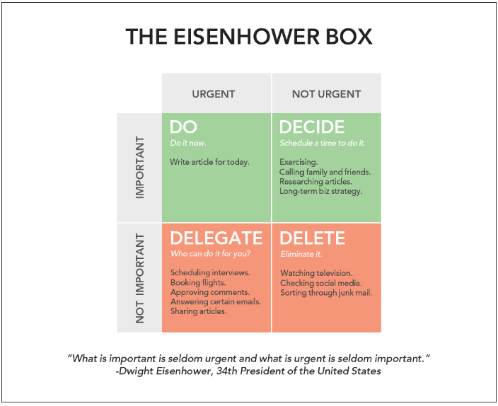

README
======

> WIP

A todo list that uses an [Eisenhower box](https://www.theenterpriseworld.com/eisenhower-box/0), which separates your tasks into four categories that can be handled differently:

Motivation
----------

There are two reasons for me to work on this:

1. It is hard to adapt most existing todo list applications to sort your todos in this way, and I find this way of prioritizing very effective for me.
2. Building this will be good practice in using Deno and Typescript, as well as (possibly) making a publicly accessable web app.

